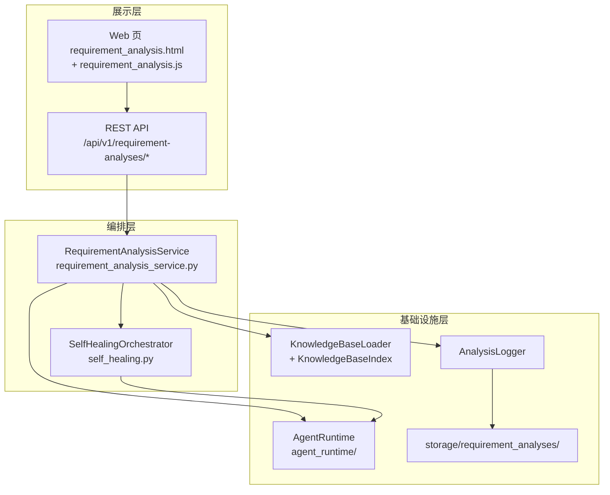
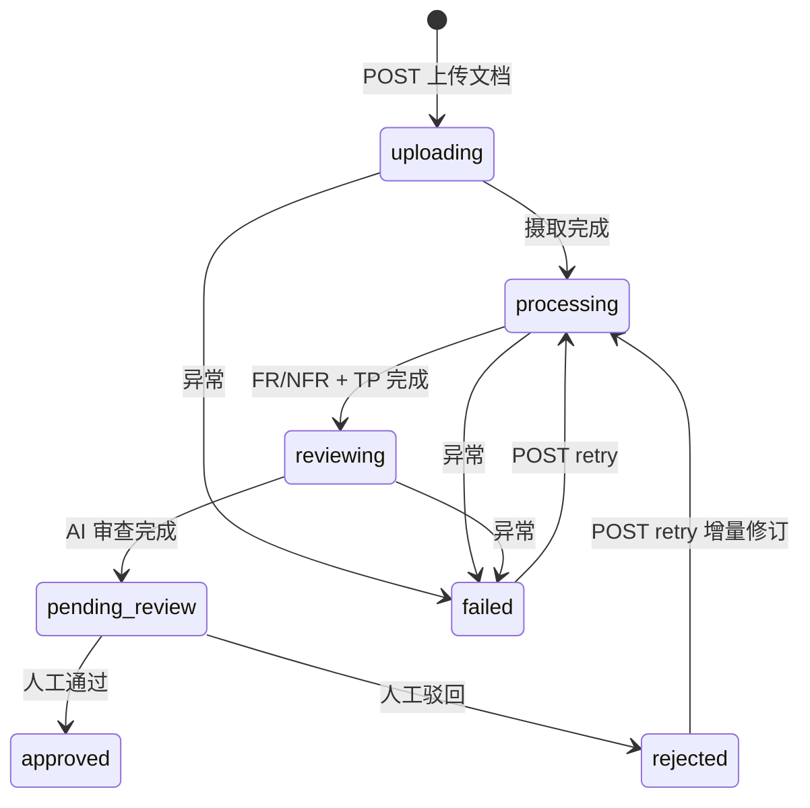
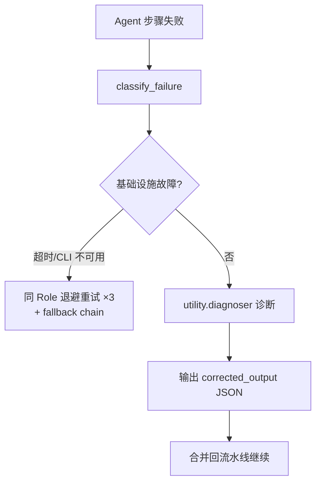
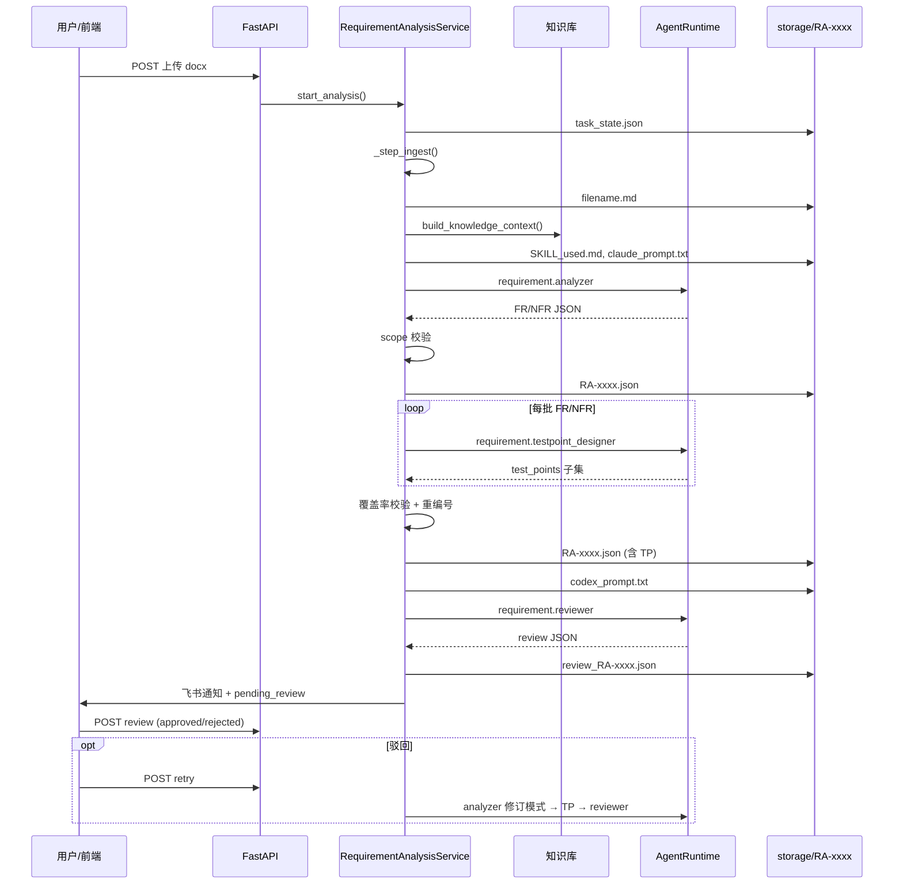

# 需求分析模块 — 完整流程讲解

本文从「模块负责人给新人讲解」的视角，梳理 TestPlatform 需求分析模块的架构、流水线、Skill 调用、产物落盘位置与人工闭环。

---

## 一、模块定位

需求分析模块是一个**独立于 Project / Pipeline 的垂直能力**：

- 用户上传 PRD（docx/pdf/xlsx 等）
- 平台自动完成：**文档摄取 → FR/NFR 拆解 → 测试点（TP）设计 → AI 审查 → 飞书通知 → 人工确认**
- 每个任务用唯一 ID 标识：`RA-0001`、`RA-0012`…
- 核心编排：`src/services/requirement_analysis_service.py`
- 存储根目录：`storage/requirement_analyses/{analysis_id}/`

与流水线里的 `RequirementAgent`（analysis 阶段）是**不同入口**：本模块是 Web 页 `/requirement-analysis` 的独立产品能力。

---

## 二、整体架构（三层）



**关键设计原则**（见 [`docs/agent_runtime.md`](agent_runtime.md)）：

- 业务代码只认 **Role**（如 `requirement.analyzer`），不硬编码 claude/codex/cursor
- Role → Backend 路由链在 `config/settings.yaml` → `agent_runtime.roles` 配置
- 每个 Agent 步骤失败时，由 **自愈编排器** 分类处理（基础设施重试 vs 输出诊断修正）

---

## 三、任务状态机



| 状态 | 含义 | 典型 progress_pct |
|------|------|-------------------|
| `uploading` | 正在摄取文档 | 5–20 |
| `processing` | Analyzer + TP 设计 | 30–55 |
| `reviewing` | Reviewer 审查中 | 85 |
| `pending_review` | 等待人工确认 | 90 |
| `approved` / `rejected` | 人工结论 | 100 |
| `failed` | 流水线失败 | — |

状态持久化：`storage/requirement_analyses/RA-xxxx/task_state.json`（不含大 JSON，大 JSON 有独立文件）。

---

## 四、入口：用户如何触发

### 4.1 前端页面

- 路由：`src/web/router.py` → `/requirement-analysis`
- 模板：`src/web/templates/pages/requirement_analysis.html`
- 脚本：`src/web/static/js/requirement_analysis.js`

用户操作：

1. 拖拽/选择文件（docx/pdf/xlsx/json/yaml/md/txt，≤10MB）
2. 可选填：目标平台、知识库模块、自定义要求
3. 点击「开始分析」→ `POST /api/v1/requirement-analyses`
4. 前端每 3 秒轮询 `GET /api/v1/requirement-analyses/{id}/status`

### 4.2 API 端点

| 方法 | 路径 | 作用 |
|------|------|------|
| POST | `/requirement-analyses` | 上传并启动分析 |
| GET | `/requirement-analyses` | 列表（分页/按状态过滤） |
| GET | `/requirement-analyses/{id}` | 详情（含 analysis_json、review_json） |
| GET | `/requirement-analyses/{id}/status` | 轻量状态轮询 |
| POST | `/requirement-analyses/{id}/review` | 人工通过/驳回 |
| POST | `/requirement-analyses/{id}/retry` | 驳回后重跑 |

实现：`src/api/v1/requirement_analysis.py`

---

## 五、主流水线（6 大步骤）

后台通过 `asyncio.create_task` 异步执行，API 立即返回 `analysis_id`。

### 步骤 0：任务创建

**代码**：`RequirementAnalysisService.start_analysis()`

1. 生成 ID：`_next_analysis_id()` → 扫描内存 + `storage/` 目录取最大序号 +1
2. 创建 `AnalysisTask` 写入内存 `_task_store`
3. 写 `task_state.json`
4. 获取文件锁 `.running.lock`（防 uvicorn reload 重复跑）
5. 启动 `_run_analysis_pipeline()`

---

### 步骤 1：文档摄取（Ingest）

**进度**：10% → 20%  
**代码**：`_step_ingest()`

| 子步骤 | 做什么 | 产出位置 |
|--------|--------|----------|
| 格式检测 | `detect_file_type()` 按扩展名 | `analysis.log` → `ingest_start` |
| 转 Markdown | `convert_to_markdown()`（docx→python-docx 等） | — |
| **污染检测** | `validate_upload_document()` 拦截 ChatGPT 对话/重复 PRD | 失败则 `doc_contamination_blocked` |
| 净化 | `sanitize_requirement_markdown()` 截断污染段 | `doc_sanitized` |
| 乱码检测 | `_is_garbled()` | — |
| 保存 | `{filename}.md` | `storage/.../RA-xxxx/{filename}.md` |

**日志**：`ingest_done`（含 `char_count`）

相关代码：

- `src/utils/document_converter.py` — 格式转换
- `src/utils/document_sanitizer.py` — 污染检测与净化

---

### 步骤 2：知识库加载

**进度**：30%  
**代码**：`KnowledgeBaseLoader.build_knowledge_context()`

流程：

1. 从文档中识别模块关键词（登录、书架、追更…）
2. **优先语义检索**：`KnowledgeBaseIndex`（Obsidian vault 分块 + embedding + SQLite 向量）
3. 失败则 **关键词兜底**：`MODULE_NOTE_MAP` 映射到 `.md` 笔记
4. 可选加载历史缺陷摘要（`ACN_buglist.xlsx`）

注入方式：替换 Skill 中 `{knowledge_context}` 占位符  
**重要**：知识库仅作术语参考，SKILL 和 loader 均声明 **不得作为 FR 来源**。

配置：`config/settings.yaml` → `knowledge_base:` 段

相关代码：

- `src/services/knowbase_loader.py`
- `src/services/knowbase_index.py`
- `scripts/rebuild_knowbase_index.py` — 重建向量索引

---

### 步骤 3：需求拆解（Analyzer）

**进度**：40%  
**Role**：`requirement.analyzer`  
**Skill**：`.agents/skills/requirement-analyzer/SKILL.md`

#### 3.1 Prompt 组装

`_build_analysis_prompt()` 拼接：

```
[SKILL 全文 + 知识库上下文]
+ 平台信息（platform_type、custom_prompt）
+ 需求文档 Markdown（超长则 _truncate_doc_by_chapters 按章节截断）
+ [修订模式] revision_baseline（上一版 JSON + 审查/人工意见）
+ 输出要求（纯 JSON）
```

快照：`claude_prompt.txt`、`SKILL_used.md`

#### 3.2 Agent 调用

```python
await agent_runtime.run(AgentTask(
    role="requirement.analyzer",
    prompt=claude_prompt,
    workdir=str(alog.dir_path),  # Agent 工作目录 = 任务目录
    timeout=动态超时（按 token 估算）,
    stage_name="requirement_analysis",
    task_id=analysis_id,
))
```

**Backend 路由**（`config/settings.yaml`）：

| Role | Primary | Fallbacks |
|------|---------|-----------|
| `requirement.analyzer` | **cursor** | claude_code → codex |

Runtime 会按链依次尝试，直到某个 backend 返回 `success=True`。

#### 3.3 Analyzer 产出结构

Skill 要求输出 JSON 对象（**不含 test_points**）：

| 字段 | 含义 |
|------|------|
| `meta` | 版本、时间、agent、target_platform |
| `functional_requirements[]` | FR-001… 含 module、priority、acceptance_criteria、**source_evidence** |
| `non_functional_requirements[]` | NFR-001… performance/security 等 |
| `risks[]` | RISK-001… |
| `analysis_notes` | 文档质量、missing_aspects |
| `performance_plan` / `security_plan` | 性能/安全测试方案摘要 |

#### 3.4 质量门禁（Analyzer 后）

| 检查 | 失败处理 |
|------|----------|
| JSON 提取 | `cli.extract_json()` 5 种策略 → 自愈 |
| 类型检查 | 必须是 dict 非 list → 自愈 |
| **FR 范围校验** | `validate_analysis_scope()`：模块必须在 `### 3.x xxx模块` 内；source_evidence 必须在原文可匹配 → 自愈 |
| FR/NFR 非空 | 自愈 |

**主产物**：`storage/.../RA-xxxx/RA-xxxx.json`（仅 FR/NFR/risk，此时尚无 TP 或 TP 为空）

**日志**：`json_parse`（fr_count、nfr_count、risk_count）、`analysis_scope_check`

相关代码：

- `src/services/requirement_evidence.py` — FR 范围与原文依据校验

---

### 步骤 4.5：测试点设计（Testpoint Designer）

**进度**：55%  
**Role**：`requirement.testpoint_designer`  
**Skill**：`.agents/skills/requirement-testpoint-designer/SKILL.md`

#### 为什么独立阶段？

Analyzer **只产 FR/NFR**，TP 由专门 Skill 生成，避免单次输出过长被截断。

#### 分批策略

`_run_testpoint_design_stage()`：

1. FR 按 **4 条/批** 拆分（`FR_TP_BATCH_SIZE=4`）
2. NFR 按 **6 条/批** 拆分（`NFR_TP_BATCH_SIZE=6`）
3. 每批调用 Agent，prompt 只含本批 FR/NFR 子集

批次命名：`FR-1`、`FR-2`…、`NFR-1`、`NFR-2`…

**Prompt 快照**：`testpoint_prompt_FR-1.txt`、`testpoint_prompt_NFR-1.txt`…

#### 每批流程

```
Agent 调用 → JSON/落盘回收 → 批次覆盖率校验 → 合并
```

- 落盘回收：`recover_json_from_workdir()` 读 `test_points_output.json` 等（防 Agent 写文件代答）
- 批次校验：`validate_testpoint_coverage(require_full=False, fr_ids=本批)`
- 合并后全局重编号：`TP-001` … `TP-N`

#### 全量覆盖率硬规则

`src/services/testpoint_coverage.py`：

- 每个 FR：P0/P1 ≥4 条 TP，P2 ≥2 条
- 每个 NFR ≥1 条 TP
- TP 总数 > FR + NFR
- ID 必须从 `TP-001` 连续（检测截断尾部，如 TP-083 起）

不达标 → `OUTPUT_QUALITY` 自愈一次 → 仍失败则抛错

**合并写回**：`RA-xxxx.json` 增加 `test_points[]`

**日志**：`testpoint_batch_plan`、`testpoint_batch_done`、`testpoint_coverage_check`、`testpoint_merge`

**Backend 路由**：

| Role | Primary | Fallbacks |
|------|---------|-----------|
| `requirement.testpoint_designer` | **cursor** | claude_code → codex |

---

### 步骤 5：AI 独立审查（Reviewer）

**进度**：85% → 90%  
**Role**：`requirement.reviewer`  
**Skill**：`.agents/skills/requirement-reviewer/SKILL.md`

#### Prompt 组成

`_build_review_prompt()`：

```
[requirement-reviewer SKILL]
+ 原始需求文档
+ 完整 analysis_json（含 FR/NFR/TP/risk，超大则 _truncate_json_for_review 摘要前 5 条）
```

快照：`codex_prompt.txt`

#### Reviewer 原则（Skill 强调）

- **独立审查**：只看「原文 + 分析 JSON」，不看 Analyzer 推理过程
- 必须区分两类缺陷：
  - `requirement_defects`：原文本身的问题（模糊、不可测、矛盾）
  - `analysis_defects`：拆解问题（遗漏、粒度、幻觉、TP 不足）

#### 产出结构

| 字段 | 含义 |
|------|------|
| `score` | 0–100 总分 |
| `dimensions` | 6 维度加权分（完整性、清晰度、可测性…） |
| `requirement_defects[]` | 需求缺陷 |
| `analysis_defects[]` | 分析缺陷 |
| `missing_items[]` | 遗漏项 |
| `hallucinations[]` | 幻觉项 |
| `improvement_suggestions[]` | 改进建议 |
| `overall_comment` | 总评 |

**产物**：`review_RA-xxxx.json`

**Backend 路由**：

| Role | Primary | Fallbacks |
|------|---------|-----------|
| `requirement.reviewer` | **codex** | cursor → claude_code |

---

### 步骤 6：通知与收尾

1. **飞书通知**：`FeishuNotifier.notify_review_complete()`（分数、FR/NFR/TP 数量、前 5 条 issue）
2. 状态 → `pending_review`，progress 100%
3. 释放 `.running.lock`
4. **日志**：`agents_notified`

---

## 六、自愈机制（Self-Healing）

**代码**：`src/services/self_healing.py`  
**诊断 Role**：`utility.diagnoser`（primary: cursor）



失败分类：

| 类别 | 典型场景 | 处理 |
|------|----------|------|
| `INFRA_TIMEOUT` / `INFRA_CLI_ERROR` | Agent 超时、CLI 不可用 | 退避重试 + 切换 backend |
| `OUTPUT_PARSE` | stdout 无法提取 JSON | diagnoser 修正 JSON |
| `OUTPUT_TYPE` | 输出是数组而非对象 | diagnoser 修正 |
| `OUTPUT_QUALITY` | FR 越界、TP 覆盖率不足、FR 为空 | diagnoser 按错误信息修正 |

诊断过程快照（均在任务目录）：

- `self_heal_diagnosis_prompt_{n}.txt`
- `self_heal_diagnosis_raw_{n}.txt`
- 可能落盘：`self_heal_corrected_output.json`

JSON 落盘回收：`src/agent_runtime/cli_shared.py` → `recover_json_from_workdir()`

---

## 七、人工审查与增量修订

### 7.1 人工审查

前端展示：

- 分析 JSON（FR/NFR/TP 表格）
- 审查 JSON（两栏：`requirement_defects` / `analysis_defects`）
- 评分与维度

提交：`POST /requirement-analyses/{id}/review`

```json
{
  "decision": "approved | rejected",
  "comment": "驳回意见",
  "corrections": [{"field": "...", "value": "..."}]
}
```

结构化保存到 `task.human_review`，**不再拼进 custom_prompt**。

### 7.2 驳回后重试

`POST /requirement-analyses/{id}/retry`

构建 `revision_baseline`：

```python
{
  "previous_analysis_json": 上一版 RA-xxxx.json,
  "previous_review_json": 上一版 review_RA-xxxx.json,
  "human_comment": 人工意见,
  "human_corrections": 修正项,
  "extra_feedback": retry 时补充反馈,
}
```

重跑时：

- **跳过文档摄取**（读已有 `{filename}.md`）
- Analyzer 进入 **修订模式**（SKILL 中「修订模式」章节）
- TP / Reviewer 全链路重跑

日志：`revise_mode`

---

## 八、产物目录一览

以 `RA-0013` 为例，任务目录结构：

```
storage/requirement_analyses/RA-0013/
├── task_state.json              # 任务元状态（status、progress、human_review…）
├── analysis.log                 # JSONL 逐步日志（排查第一现场）
├── .running.lock                # 运行中锁（完成后删除）
│
├── 爱奇艺叭嗒 App 产品需求文档.docx.md   # 摄取后的 Markdown
├── SKILL_used.md                # 注入知识库后的 Analyzer Skill 快照
├── claude_prompt.txt            # Analyzer 完整 prompt
├── RA-0013.json                 # 主产物：FR + NFR + risk + test_points
│
├── testpoint_prompt_FR-1.txt    # TP 分批 prompt（每批一个）
├── testpoint_prompt_FR-2.txt
├── testpoint_prompt_NFR-1.txt
├── …
│
├── codex_prompt.txt             # Reviewer 完整 prompt
├── review_RA-0013.json          # AI 审查报告
│
├── claude_raw_output.txt        # （失败时）Analyzer 原始 stdout
├── codex_raw_output.txt         # （失败时）Reviewer 原始 stdout
├── testpoint_raw_output.txt     # （失败时）TP 原始 stdout
│
└── self_heal_*                  # （触发自愈时）诊断 prompt/输出
```

### analysis.log 关键 step 对照表

| step | 阶段 |
|------|------|
| `task_created` | 任务创建 |
| `ingest_start` / `ingest_done` | 文档摄取 |
| `doc_contamination_blocked` | 文档污染阻断 |
| `doc_sanitized` | 文档净化 |
| `skill_load` | 加载 Analyzer Skill |
| `agent_start` / `agent_done` | 各 Role Agent 调用 |
| `json_parse` | Analyzer JSON 解析统计 |
| `analysis_scope_check` | FR 范围校验 |
| `testpoint_batch_plan` | TP 分批计划 |
| `testpoint_batch_done` | 单批 TP 完成 |
| `testpoint_coverage_check` | TP 覆盖率校验 |
| `testpoint_merge` | TP 合并完成 |
| `review_parse` | 审查分数 |
| `human_review_submitted` | 人工结论 |
| `revise_mode` | 增量修订模式 |
| `pipeline_error` | 流水线失败 |

---

## 九、Skill 与 Role 对照总表

| 阶段 | Role | Skill 文件 | 输入 | 输出 |
|------|------|-----------|------|------|
| 需求拆解 | `requirement.analyzer` | `.agents/skills/requirement-analyzer/SKILL.md` | PRD + 知识库 + 平台信息 | FR/NFR/risk/plan |
| 测试点设计 | `requirement.testpoint_designer` | `.agents/skills/requirement-testpoint-designer/SKILL.md` | PRD + 定稿 FR/NFR JSON | `test_points[]` |
| AI 审查 | `requirement.reviewer` | `.agents/skills/requirement-reviewer/SKILL.md` | PRD + 完整 analysis JSON | review JSON |
| 自愈诊断 | `utility.diagnoser` | （内建诊断 prompt，无独立 Skill 文件） | 失败上下文 + 原始输出 | `corrected_output` |

> 注：`.agents/skills/requirement-parser/SKILL.md` 存在于仓库，但**当前 Web 需求分析模块未调用**，属于备用/其他入口。

Skill 加载：`src/llm/prompts/skill_loader.py` → `load_skill("requirement-analyzer")`

---

## 十、配置与运行时依赖

### 10.1 核心配置

| 文件 | 内容 |
|------|------|
| `config/settings.yaml` | `agent_runtime.roles/backends`、`knowledge_base` |
| `deployments/.env.example` | `CURSOR_API_KEY`、飞书 webhook 等 |

### 10.2 Agent Backend 类型

| Backend | 实现 | 调用方式 |
|---------|------|----------|
| `cursor` | `backends/cursor.py` | Cursor SDK（local 模式） |
| `claude_code` | `backends/claude_code.py` | `claude -p "{prompt}"` |
| `codex` | `backends/codex.py` | `codex exec --skip-git-repo-check` + stdin prompt |

### 10.3 上下文窗口管理

常量（`requirement_analysis_service.py`）：

- `MODEL_CONTEXT_WINDOW = 180000` tokens
- `MAX_INPUT_TOKENS ≈ 155000`
- 文档超长 → `_truncate_doc_by_chapters()`（保留前 2 章 + 后 1 章完整，中间摘要）
- 审查 JSON 超大 → `_truncate_json_for_review()`（每数组保留前 5 条）

---

## 十一、可靠性设计

| 机制 | 作用 |
|------|------|
| `_task_store` 内存 + `task_state.json` | 状态持久化 |
| 启动时 `_scan_storage_for_tasks()` | 服务重启恢复任务 |
| `.running.lock` | 防重复执行（2h 僵尸锁自动清理） |
| `MAX_RECOVERY_ATTEMPTS = 3` | 中断自动恢复上限 |
| `recovery_count` | 记录恢复次数 |

中断恢复逻辑：若 status 为 uploading/processing/reviewing 且无 review 文件，服务启动后会尝试从已有 `{filename}.md` 续跑 `_run_analysis_with_content()`。

---

## 十二、端到端时序



---

## 十三、排查指南

分析任务出问题时，建议按以下顺序自查：

1. **`analysis.log`** — 当前卡在哪一步、`agent_start` 的 role/backend
2. **`{filename}.md`** — 摄取后的文档是否干净（无 ChatGPT 污染）
3. **`claude_prompt.txt`** — 实际喂给 Analyzer 的完整 prompt
4. **`RA-xxxx.json`** — FR 模块是否在第三章范围内、TP 是否完整
5. **`testpoint_prompt_FR-*.txt`** — 分批 TP 是否正常推进
6. **`review_RA-xxxx.json`** — 最终 AI 评分与两类缺陷

---

## 十四、与流水线 analysis 阶段的区别

| 维度 | Web 需求分析模块 | Pipeline analysis 阶段 |
|------|------------------|------------------------|
| 入口 | `/requirement-analysis` 页 | 创建 Pipeline 上传文档 |
| ID | `RA-xxxx` | `pipeline_id` + context |
| TP 阶段 | 独立 testpoint_designer 分批 | 同左（若已改造） |
| 人工卡点 | 本模块 `pending_review` | Pipeline `review` 阶段暂停 |
| 存储 | `storage/requirement_analyses/` | DB context + storage/documents |

---

## 十五、关键源码索引

| 模块 | 路径 |
|------|------|
| 核心编排 | `src/services/requirement_analysis_service.py` |
| REST API | `src/api/v1/requirement_analysis.py` |
| Agent 运行时 | `src/agent_runtime/` |
| 自愈编排 | `src/services/self_healing.py` |
| 知识库加载 | `src/services/knowbase_loader.py` |
| 知识库索引 | `src/services/knowbase_index.py` |
| FR 范围校验 | `src/services/requirement_evidence.py` |
| TP 覆盖率校验 | `src/services/testpoint_coverage.py` |
| 文档净化 | `src/utils/document_sanitizer.py` |
| 文档转换 | `src/utils/document_converter.py` |
| 分析日志 | `src/utils/analysis_logger.py` |
| 前端页面 | `src/web/templates/pages/requirement_analysis.html` |
| 前端脚本 | `src/web/static/js/requirement_analysis.js` |
| Agent 接入指南 | `docs/agent_runtime.md` |

---

## 十六、相关单测

| 测试文件 | 覆盖内容 |
|----------|----------|
| `tests/unit/test_requirement_doc_scope.py` | 文档污染阻断、FR 范围校验 |
| `tests/unit/test_testpoint_coverage.py` | TP 覆盖率、截断尾部检测 |
| `tests/unit/test_json_artifact_recover.py` | JSON 落盘回收 |
| `tests/unit/test_requirement_analysis_revise.py` | 增量修订 prompt |
| `tests/unit/test_knowbase_index.py` | 知识库向量索引 |
| `tests/integration/test_requirement_analysis_with_runtime.py` | 端到端集成 |
